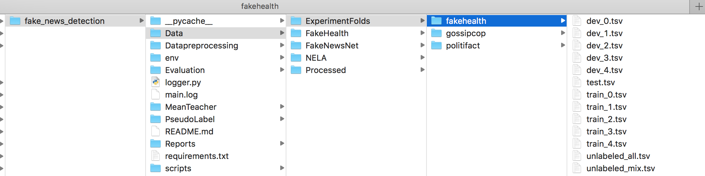

# Mean Teacher BERT discovers Fake News
Mean Teacher BERT discovers Fake News

## Abstract
Dissemination  of  fake  news  has  been  ubiquitous  with  theproliferation of social media platforms in this digital age. If the intentis  harmful,  fake  news  could  impact  negatively  on  our  society.  There-fore, it is vital to automatically detect the news potentially contain fakenews  before  reaching  to  large  audience.  Collecting  high  quality  of  la-beled corpus for the fake news detection models is a labor-intensive anda challenging step. To overcome this challenge, in this study, we evaluatesemi-supervised training schemas for fake news detection of news articleson publicly available datasets and compare the experimental results withthe state-of-art fake news detection models. The schemas that we eval-uate are Mean-Teacher, TODO ADD YOUR SIGNIFICANT RESULT.Our source code is publicly available1

## Datasets

For our paper, we use the following datasets:

* [FakeNewsNet](https://github.com/KaiDMML/FakeNewsNet) contains news articles in politics and entertainment.
* [FakeHealth](https://zenodo.org/record/3862989) contains news articles in health.
* [NELA](https://dataverse.harvard.edu/dataverse/nela), [NELA-2017](https://dataverse.harvard.edu/dataset.xhtml?persistentId=doi:10.7910/DVN/ZCXSKG) and [NELA-2018](https://dataverse.harvard.edu/dataset.xhtml?persistentId=doi:10.7910/DVN/ULHLCB) are used for unlabeled samples. From the [NELA-2019]() dataset, we use the aggregated labels. 

:warning: Please cite the papers of these studies if you use them. 

Run the [bash code](scripts/data_processing.sh) in order to get experiment folds.


You are supposed to see the processed files in `Data` folder

## The Data\Input2 is the dataset on which overall comparision have been done and it is default dataset for model.The reports also generated from dataset2

## Starting
Python compiler is `3.7.9`.
Install libraries in requirements.txt:
```console
pip3 install -r requirements.txt
```

| Parameter | Description | Default value|
|-----------|-------------|--------------|
|--lr | learning rate| 0.0001|
|--epochs | epochs| 1|
|--batch_size | Batch size | 1|
|--maxlen | Lenght of article for tokens | 512|
|--model | Meanteacher(MT) or Bert or PI |MT| 
|--data | fakehealth or politifact or gossipcop |fakehealth|
|--pretrained_model|'bert-base-uncased', 'bert-base-cased'|bert-base-uncased|
|--ratio | Used in overall cost for mean teacher | 0.5|
|--alpha | EMA alpha value for mean teacher| 0.99|
|--noise_ratio |unlabel data noise ratio for Mean teacher|0.2|
|--dropout|drop out value |0.2|
|--data_folder|folder location of data| |
|--model_output_folder| model saving location| |
|--do_train| only for BERT model |'store_true'|
|--seed| | |


Command to generate the fake news:
```console
python3 -m fake_news_generator \
--data_folder Data/ExperimentFolds/3 \
--data fakehealth \
--processed_output_folder Data/ExperimentFolds/3
```
Command for preprocessing the data:
```console
--data_folder Data/ExperimentFolds/3 \
--data fakehealth \
--processed_output_folder Data/Processed/3
```

Example command to run only BERT model:
```console
python -m BERT.main \
--model bert \
--data_folder 'Data/ExperimentFolds/3' \
--data politifact \
--model_output_folder trained_models \
--pretrained_model bert-base-cased \
--max_len 512 \
--dropout 0.1 \
--epochs 1 \
--batch_size 1 \
--lr 2e-5 \
--seed 42 \
--do_train
```

Command to run Mean teacher with BERT:
```console
python3 -m main \
--model MT \
--data_folder Data/ExperimentFolds/3 \
--data fakehealth \
--model_output_folder trained_models \
--epochs 3 \
--lr 0.0001 \
--batch_size 1 \
--dropout 0.1 \
--max_len 512 \
--alpha 0.99 \
--ratio 0.5 \
--noise_ratio 0.9
```
Command to run Pi model with BERT:
```console
python3 -m main \
--model PI \
--data_folder Data/ExperimentFolds/3 \
--data fakehealth \
--model_output_folder trained_models \
--epochs 3 \
--dropout 0.1 \
--lr 0.0001 \
--batch_size 1 \
--max_len 512 \
```


## Contributors
Ipek Baris 

Bhupender kumar Saini

